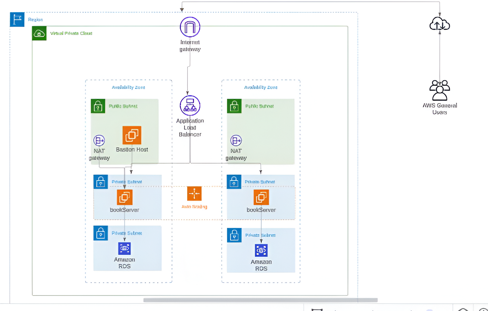

# CloudArchitecture_TTI
High scalable and available infrastructure from AWS

## Planning

### Requirements
* "El mundo de las letras" bookstore has become the latinamerican book provider of preference. The company constantly participate on book fairs and as part of marketing strategy they offer discounts, so it needs a high scalable and available architecture. 
* Requerimiento 2
* Requerimiento 3

### Architecture
The following image shows the proposed architecture given the previous requirements

## Deployment
